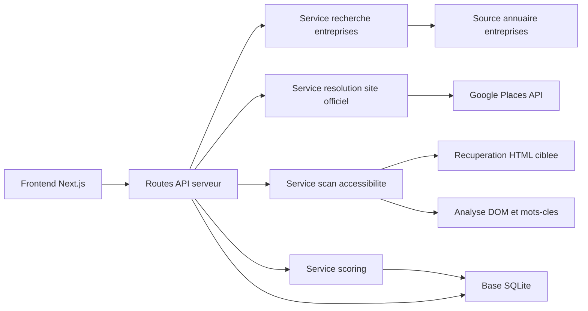
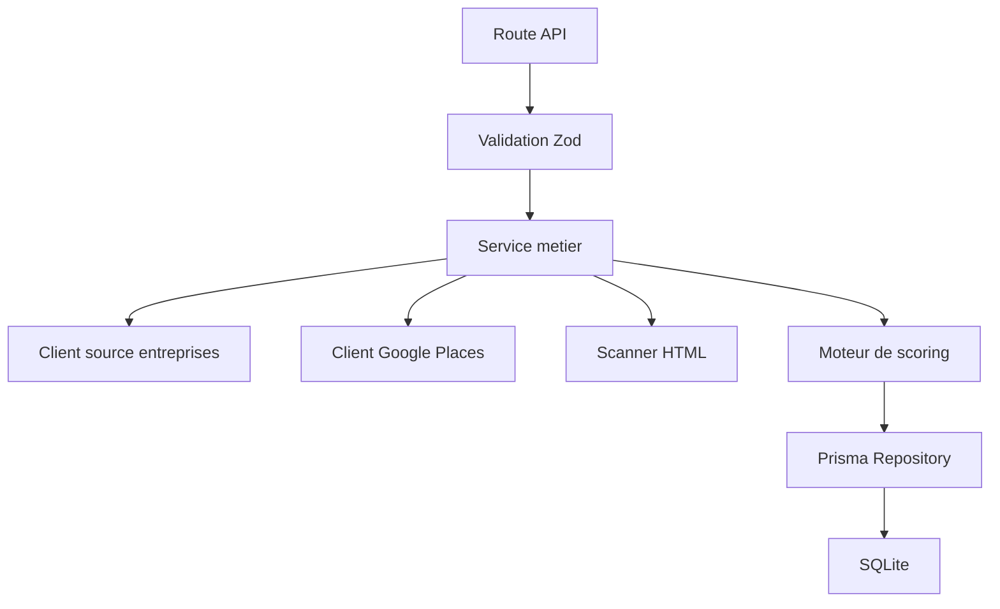
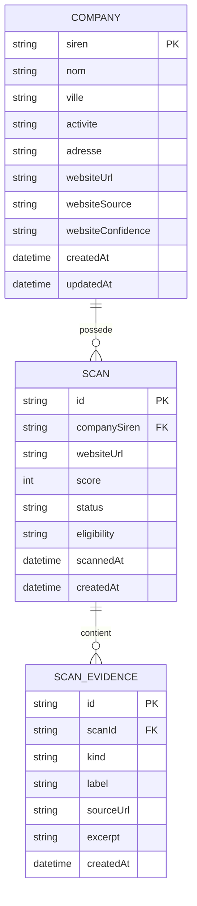

## 1. Conception d'architecture


## 2. Description technologique
- Frontend : Next.js 15 + React 18 + TypeScript + Tailwind CSS 3
- Initialisation : create-next-app
- Backend : routes serveur Next.js via App Router
- Base de donnees : SQLite + Prisma pour un MVP local simple
- Parsing HTML : Cheerio
- Validation : Zod
- Requetes HTTP : fetch natif
- Tests cibles : Vitest pour la logique de scoring et de parsing
- Services externes : Google Places API pour retrouver ou confirmer le site officiel

## 3. Definitions des routes
| Route | Usage |
|-------|-------|
| / | Recherche d'entreprise et liste de resultats |
| /entreprise/[siren] | Fiche entreprise et contexte d'analyse |
| /analyse/[scanId] | Detail complet d'une analyse |
| /historique | Liste des analyses recentes |

## 4. Definitions des API
### 4.1 Recherche entreprise
`GET /api/companies/search?q={query}&city={city}`

```ts
type CompanySearchResult = {
  siren: string;
  nom: string;
  ville: string | null;
  activite: string | null;
  adresse: string | null;
};
```

### 4.2 Resolution du site officiel
`POST /api/companies/resolve-website`

```ts
type ResolveWebsiteRequest = {
  siren: string;
  nom: string;
  adresse?: string;
  ville?: string;
};

type ResolveWebsiteResponse = {
  websiteUrl: string | null;
  source: "google_places" | "manuel" | "inconnue";
  confidence: "haute" | "moyenne" | "faible";
  notes: string[];
};
```

### 4.3 Lancement d'analyse
`POST /api/scans`

```ts
type CreateScanRequest = {
  siren: string;
  websiteUrl: string;
};

type CreateScanResponse = {
  scanId: string;
  status: "queued" | "done";
};
```

### 4.4 Detail d'analyse
`GET /api/scans/{scanId}`

```ts
type ScanEvidence = {
  kind:
    | "page_accessibilite"
    | "declaration"
    | "mention_accueil"
    | "contact_accessibilite"
    | "mot_cle";
  label: string;
  sourceUrl: string;
  excerpt?: string;
};

type ScanDetailResponse = {
  id: string;
  siren: string;
  companyName: string;
  websiteUrl: string;
  score: number;
  status:
    | "elements_detectes"
    | "elements_partiels"
    | "conformite_non_demontree"
    | "a_verifier_manuellement";
  eligibility:
    | "soumis_probable"
    | "hors_perimetre_probable"
    | "incertain";
  evidences: ScanEvidence[];
  scannedAt: string;
};
```

## 5. Architecture serveur


## 6. Modele de donnees
### 6.1 Definition du modele


### 6.2 Definition SQL initiale
```sql
CREATE TABLE company (
  siren TEXT PRIMARY KEY,
  nom TEXT NOT NULL,
  ville TEXT,
  activite TEXT,
  adresse TEXT,
  website_url TEXT,
  website_source TEXT,
  website_confidence TEXT,
  created_at DATETIME NOT NULL DEFAULT CURRENT_TIMESTAMP,
  updated_at DATETIME NOT NULL DEFAULT CURRENT_TIMESTAMP
);

CREATE TABLE scan (
  id TEXT PRIMARY KEY,
  company_siren TEXT NOT NULL,
  website_url TEXT NOT NULL,
  score INTEGER NOT NULL,
  status TEXT NOT NULL,
  eligibility TEXT NOT NULL,
  scanned_at DATETIME NOT NULL,
  created_at DATETIME NOT NULL DEFAULT CURRENT_TIMESTAMP,
  FOREIGN KEY (company_siren) REFERENCES company(siren)
);

CREATE TABLE scan_evidence (
  id TEXT PRIMARY KEY,
  scan_id TEXT NOT NULL,
  kind TEXT NOT NULL,
  label TEXT NOT NULL,
  source_url TEXT NOT NULL,
  excerpt TEXT,
  created_at DATETIME NOT NULL DEFAULT CURRENT_TIMESTAMP,
  FOREIGN KEY (scan_id) REFERENCES scan(id)
);

CREATE INDEX idx_scan_company_siren ON scan(company_siren);
CREATE INDEX idx_scan_evidence_scan_id ON scan_evidence(scan_id);
```

## 7. Regles de scoring du MVP
- +40 si une page accessibilite dediee est detectee
- +25 si une declaration d'accessibilite est detectee
- +15 si une mention d'etat de conformite apparait sur la page d'accueil
- +10 si un mecanisme de contact accessibilite est detecte
- +5 par evidence textuelle complementaire pertinente, plafonne
- -30 si l'entreprise semble soumise et qu'aucun element public n'est detecte
- -20 si le site officiel n'est pas resolu avec une confiance suffisante

## 8. Strategie d'implementation
- Etape 1 : initialiser l'application Next.js avec Tailwind et Prisma
- Etape 2 : construire la recherche et la fiche entreprise avec donnees mockees puis branchement aux sources reelles
- Etape 3 : integrer Google Places pour la resolution du site
- Etape 4 : implementer le scanner HTML cible avec Cheerio
- Etape 5 : stocker les scans et afficher l'historique
- Etape 6 : ajouter tests unitaires sur le scoring et les detecteurs de mots-cles

## 9. Contraintes et garde-fous
- Toujours presenter le resultat comme un indice de risque ou une conformite non demontree
- Conserver la trace des preuves detectees pour audit humain
- Ne jamais afficher de cle API en clair dans le code; utilisation via variable d'environnement `GOOGLE_PLACES_API_KEY`
- Prevoir des delais reseau et des messages d'erreur simples pour les sites non joignables ou bloques
