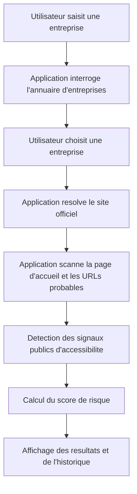

## 1. Vue d'ensemble du produit
Application web de veille permettant d'identifier des entreprises potentiellement soumises aux obligations d'accessibilite numerique, puis de detecter si leur site public expose les elements attendus (page accessibilite, declaration, mention d'etat de conformite, contact).
- Le produit aide a prioriser les controles manuels et les audits RGAA en transformant des donnees publiques et des signaux web en score de risque exploitable.
- La valeur principale est de gagner du temps sur la qualification: quelles entreprises regarder en premier, quels sites semblent hors radar, et quels acteurs affichent deja des preuves publiques de conformite.

## 2. Fonctionnalites coeur

### 2.1 Roles utilisateurs
| Role | Methode d'acces | Permissions coeur |
|------|-----------------|-------------------|
| Analyste | Acces simple sans inscription dans le MVP | Rechercher une entreprise, lancer une analyse, consulter l'historique local |

### 2.2 Modules fonctionnels
1. **Page de recherche** : recherche par nom d'entreprise, ville ou SIREN, affichage d'une liste de correspondances.
2. **Fiche entreprise** : resume de l'entreprise, site officiel detecte, contexte de soumission estime.
3. **Page d'analyse** : scan des signaux publics d'accessibilite, score de risque, details des preuves trouvees.
4. **Historique** : consultations recentes, dernier score calcule, date de scan.

### 2.3 Details des pages
| Nom de page | Nom du module | Description fonctionnelle |
|-------------|---------------|---------------------------|
| Recherche | Barre de recherche | Recherche une entreprise via nom, ville ou SIREN avec autocompletion simple |
| Recherche | Resultats | Affiche raison sociale, ville, activite, SIREN et action d'analyse |
| Fiche entreprise | Resume entreprise | Presente identite, activite, adresse, site detecte et source du site |
| Fiche entreprise | Eligibilite estimee | Indique si l'entreprise semble concernee, hors perimetre ou incertaine |
| Analyse | Resume du scan | Affiche URL analysee, date, statut global et score |
| Analyse | Signaux trouves | Montre page accessibilite, declaration, mention d'accueil, contact, mots-cles detectes |
| Analyse | Justificatifs | Liste les URLs, extraits de texte et evidences detectees |
| Analyse | Limites | Rappelle que le resultat est un indicateur de risque et non une conclusion juridique |
| Historique | Liste des analyses | Conserve les derniers scans avec filtres simples |

## 3. Processus coeur
L'utilisateur recherche une entreprise, selectionne une fiche, laisse l'application retrouver ou confirmer le site officiel, puis lance un scan cible des pages publiques les plus probables. Le systeme collecte les signaux visibles d'accessibilite, calcule un score interpretable et affiche les preuves detectees ainsi que les zones d'incertitude.

## 4. Conception de l'interface
### 4.1 Style visuel
- Direction artistique : tableau de bord editorial et technique, sobre mais distinctif, avec une forte lisibilite pour un usage de veille.
- Couleurs principales : fond ardoise profond, surfaces ivoire legerement teintees, accent cuivre/orange pour les alertes et accent vert mousse pour les signaux positifs.
- Style des boutons : coins moyens, contraste eleve, etats hover francs, badges de statut tres lisibles.
- Typographie : une police d'affichage serieuse et anguleuse pour les titres, associee a une police texte tres lisible pour les contenus analytiques.
- Mise en page : desktop-first, colonnes larges, panneaux d'analyse, tableaux denses mais aeres, sections a forte hierarchie visuelle.
- Iconographie : pictogrammes simples de type dossier, radar, alerte, validation, lien, document.

### 4.2 Vue par page
| Nom de page | Nom du module | Elements UI attendus |
|-------------|---------------|----------------------|
| Recherche | Hero utilitaire | Titre fort, sous-titre tres concret, champ central de recherche |
| Recherche | Liste de resultats | Cartes compactes ou tableau hybride avec badges d'activite |
| Fiche entreprise | Panneau resume | Bloc identite, bloc site detecte, bloc soumission estimee |
| Analyse | En-tete de resultat | Score, statut, horodatage, URL analysee |
| Analyse | Panneau preuves | Liste de checks, liens vers preuves, extraits textuels |
| Analyse | Panneau risque | Explication du score et prochaines actions recommandees |
| Historique | Tableau des scans | Dates, entreprise, statut, score, acces au detail |

### 4.3 Responsive
- Approche desktop-first pour privilegier l'usage analyste.
- Adaptation tablette avec empilement progressif des panneaux.
- Version mobile fonctionnelle mais secondaire, avec cartes verticales et tableaux transformes en blocs.

## 5. Perimetre du MVP
- Recherche et selection d'entreprise via une source publique d'identite.
- Resolution du site officiel a l'aide d'une combinaison de donnees publiques et de Google Places API.
- Scan cible de la page d'accueil, du footer et de routes probables comme `/accessibilite`, `/accessibility`, `/mentions-legales`, `/plan-du-site`, `sitemap.xml`.
- Detection de textes et liens tels que `declaration d'accessibilite`, `Accessibilite : non conforme`, `Accessibilite : partiellement conforme`, `Accessibilite : totalement conforme`, `signaler un defaut d'accessibilite`, `Defenseur des droits`.
- Calcul d'un score simple avec categories `elements detectes`, `elements partiels`, `conformite non demontree`, `a verifier manuellement`.
- Historique local des analyses.

## 6. Hors perimetre initial
- Audit RGAA complet ou certification juridique.
- Crawl massif de l'ensemble du web francais.
- Authentification multi-utilisateur.
- Facturation, abonnement ou exports complexes.
- Enrichissement financier exhaustif pour toutes les entreprises.

## 7. Hypotheses produit
- L'utilisateur principal est une personne qui qualifie des entreprises a controler ou a prospecter.
- Le MVP doit rester prudent dans sa formulation et presenter un score de risque, pas une accusation ferme de non-conformite.
- Le lien entre entreprise et site officiel est un point critique, donc le produit doit toujours afficher la source ou le niveau de confiance de cette resolution.
